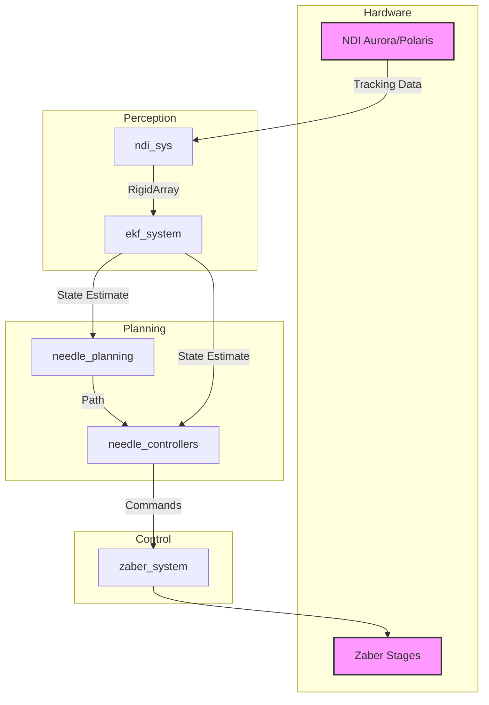
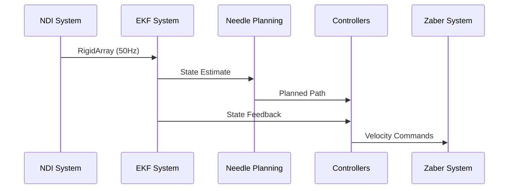

# Needle-NDI-Project

[](https://docs.ros.org/en/humble/)

## Table of Contents

1. [Overview](#overview)
2. [Core Subsystems](#core-subsystems)
3. [System Architecture](#system-architecture)
4. [Key Features](#key-features)
5. [Prerequisites](#prerequisites)
6. [Installation](#installation)
7. [Package Details](#package-details)
8. [System Integration](#system-integration)
9. [Development Guidelines](#development-guidelines)
10. [Conclusion](#conclusion)

## Overview

The Needle-NDI-Project is a comprehensive ROS2-based system designed for high-precision robotic needle manipulation in medical procedures such as prostate biopsies. The system integrates real-time tracking, state estimation, path planning, and control subsystems to achieve accurate and reliable needle guidance.

### Core Capabilities

- Real-time 6-DOF needle tracking using NDI optical systems
- Extended Kalman Filter-based state estimation
- Machine learning and geometric path planning
- Multiple control modes (autonomous/teleoperated)
- Hardware abstraction for Zaber linear stages

## Core Subsystems

Each ROS2 package in the system serves a specific purpose in the needle control pipeline:

### 1. EKF System (`ekf_system`)

Implements an Extended Kalman Filter (EKF) for state estimation by fusing data from various sensors, including NDI tracking data and control commands. The EKF provides real-time estimations of the needle's pose and velocity, crucial for precise control and feedback mechanisms. For more details, refer to the [EKF System README](https://github.com/Needle-NDI-Project/ekf_system?tab=readme-ov-file#ekf-system-package).

### 2. NDI System (`ndi_sys`)

Provides comprehensive integration for Northern Digital Inc. (NDI) optical tracking systems, specifically supporting Polaris and Aurora series. Manages real-time 6-DOF tracking of rigid bodies using optical markers and seamlessly integrates with the ROS2 control framework. For more details, refer to the [NDI System README](https://github.com/Needle-NDI-Project/ndi_sys?tab=readme-ov-file#ndi-system)

### 3. Needle Controllers (`needle_controllers`)

Implements various control algorithms for robotic needle manipulation, including Broyden-based velocity control for autonomous steering and teleoperation interfaces. Supports both autonomous and manual control modes with real-time performance and proper safety measures. For more details, refer to the [Needle Controllers README](https://github.com/Needle-NDI-Project/needle_controllers?tab=readme-ov-file#needle-controllers)

### 4. Needle Planning (`needle_planning`)

Delivers comprehensive path planning solutions using multiple approaches from geometric methods to machine learning-based solutions. Incorporates real-time path generation, validation, and optimization while considering tissue deformation models. For more details, refer to the [Needle Planning README](https://github.com/Needle-NDI-Project/needle_planning?tab=readme-ov-file#needle-planning)

### 5. Zaber System (`zaber_system`)

Provides hardware interface drivers and control integration for Zaber linear motion systems. Enables precise control of linear stages through standardized ROS2 interfaces, supporting both position and velocity control modes with proper safety features. For more details, refer to the [Zaber System README](https://github.com/Needle-NDI-Project/zaber_system?tab=readme-ov-file#zaber-system)

## System Architecture

### Component Diagram



### Data Flow



## Key Features

### 1. State Estimation (`ekf_system`)

- Extended Kalman Filter for real-time pose estimation
- Multi-sensor fusion capabilities
- High-frequency state updates (50Hz)
- Comprehensive validation system

### 2. Tracking System (`ndi_sys`)

- Support for NDI Aurora and Polaris systems
- Real-time 6-DOF tracking
- Multiple tool management
- Automatic tool detection and configuration

### 3. Motion Control (`needle_controllers`)

- Multiple control strategies:
  - Broyden-based autonomous control
  - Space Navigator teleoperation
  - Keyboard teleoperation
- Real-time performance
- Safety-first implementation

### 4. Path Planning (`needle_planning`)

- Multiple planning approaches:
  - Geometric planning
  - Machine learning-based planning
  - Hybrid methods
  - Sampling-based planning
- Real-time path generation
- FEM-based validation

### 5. Hardware Interface (`zaber_system`)

- Complete ROS2 Control integration
- Support for multiple Zaber series
- Position and velocity control modes
- Real-time performance monitoring

## Prerequisites

### Software Requirements

- Ubuntu 22.04 or later
- ROS2 Humble or later
- Python 3.8+
- C++17 compatible compiler
- CMake 3.8+

### Hardware Requirements

- NDI Aurora/Polaris tracking system
- Zaber linear stages (X-LSM/X-LHM/VSR series)
- USB connections for devices
- Compatible tracking tools with ROM files

## Installation

1. Create workspace:

    ```bash
    mkdir -p needle_ws/src
    cd needle_ws/src
    ```

2. Clone repositories:

    ```bash
    git clone https://github.com/Needle-NDI-Project/ekf_system.git
    git clone https://github.com/Needle-NDI-Project/ndi_sys.git
    git clone https://github.com/Needle-NDI-Project/needle_controllers.git
    git clone https://github.com/Needle-NDI-Project/needle_planning.git
    git clone https://github.com/Needle-NDI-Project/zaber_system.git
    ```

3. Install dependencies:

    ```bash
    cd ..
    rosdep install --from-paths src --ignore-src -r -y
    ```

4. Build workspace:

    ```bash
    colcon build --cmake-args -DCMAKE_BUILD_TYPE=Release
    source install/setup.bash
    ```

## Package Details

### EKF System

Main interfaces:

```plaintext
Topics:
  /ekf_state_estimate [geometry_msgs/PoseWithCovarianceStamped]
Services:
  /ekf_system/get_filter_state
  /ekf_system/reset_filter
```

### NDI System

Main interfaces:

```plaintext
Topics:
  /ndi_tracker/state [ndi_msgs/RigidArray]
  /joint_states [sensor_msgs/JointState]
Services:
  /ndi_system/get_tool_state
```

### Needle Controllers

Main interfaces:

```plaintext
Topics:
  /cmd_vel [geometry_msgs/Twist]
  /joint_states [sensor_msgs/JointState]
Controllers:
  - broyden_needle_controller
  - spacenav_teleop_needle_controller
  - keyboard_teleop_needle_controller
```

### Needle Planning

Main interfaces:

```plaintext
Services:
  /needle_planner [needle_planner_msgs/NeedlePlan]
Topics:
  /planned_path [geometry_msgs/PolygonStamped]
```

### Zaber System

Main interfaces:

```plaintext
Topics:
  /joint_states [sensor_msgs/JointState]
  /cmd_vel [geometry_msgs/Twist]
Controllers:
  - velocity_controller
  - position_controller
```

## System Integration

### Launch Files

Main system launch:

```bash
ros2 launch needle_bringup needle_system.launch.py
```

### Configuration

System-wide parameters in `config/system_params.yaml`:

```yaml
controller_manager:
  ros__parameters:
    update_rate: 100

ekf_system:
  ros__parameters:
    update_rate: 50

ndi_system:
  ros__parameters:
    device_ip: "192.155.1.80"
```

## Development Guidelines

### Common Tools

```bash
# Monitor system state
ros2 topic echo /ekf_state_estimate

# Check controller status
ros2 control list_controllers

# Validate transformations
ros2 run tf2_tools view_frames
```

### Troubleshooting

For common issues and solutions, refer to individual package READMEs:

- [EKF System Troubleshooting](https://github.com/Needle-NDI-Project/ekf_system?tab=readme-ov-file#troubleshooting)
- [NDI System Troubleshooting](https://github.com/Needle-NDI-Project/ndi_sys?tab=readme-ov-file#troubleshooting)
- [Needle Planner Troubleshooting](https://github.com/Needle-NDI-Project/needle_planning/blob/main/needle_planner/README.md#troubleshooting)
- [Needle Planner Message Troubleshooting](https://github.com/Needle-NDI-Project/needle_planning/blob/main/needle_planner_msgs/README.md#troubleshooting)
- [Zaber Description Troubleshooting](https://github.com/Needle-NDI-Project/zaber_system/blob/main/zaber_description/README.md#troubleshooting)
- [Zaber Driver Troubleshooting](https://github.com/Needle-NDI-Project/zaber_system/blob/main/zaber_robot_driver/README.md#troubleshooting)

## Conclusion

The Needle-NDI-Project represents a sophisticated integration of multiple ROS2 packages, each handling a specific aspect of the robotic needle control system. This modular architecture facilitates scalability, maintainability, and clear separation of concerns. The system leverages ROS2's communication framework to ensure reliable real-time data sharing and coordination between subsystems, which is essential for precise needle manipulation in medical procedures.

The combination of advanced state estimation (EKF), high-precision tracking (NDI), sophisticated control algorithms, intelligent path planning, and reliable hardware interfaces (Zaber) creates a robust framework for performing delicate medical procedures like prostate biopsies. The system's emphasis on safety, real-time performance, and accuracy makes it suitable for clinical applications while remaining flexible enough for research and development.

Through careful system design and comprehensive testing, the project ensures reliable operation while maintaining the ability to extend functionality through its modular architecture. The extensive documentation and development guidelines enable both users and developers to effectively work with and contribute to the system.
